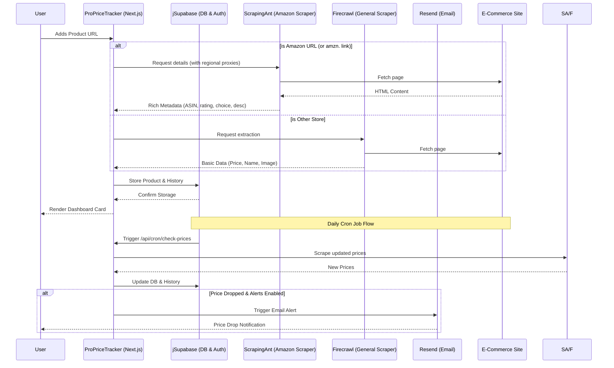

# ProPriceTracker - Advanced E-Commerce Price Monitor

**Live Demo:** [https://khareedley.vercel.app](https://buykarley.vercel.app)

ProPriceTracker is an intelligent and automated price tracking application that allows users to monitor product prices across various e-commerce platforms. Built with a modern Next.js stack, it uses Firecrawl for structured scraping, Supabase for scalable backend operations, and Resend for transactional email alerts.

## Key Features

- 🛒 **Universal Tracking:** Monitor items from Amazon (using ScrapingAnt) and other sites like BestBuy, Zara, Walmart (via Firecrawl).
- 📊 **Detailed Amazon Metadata:** Extracts and displays star ratings, review counts, popularity scores, choice badges, ASIN numbers, and collapsible features/descriptions.
- 📈 **Price Trends & Alerts:** Visualize history with interactive charts, toggle price alerts, and receive email notifications on price drops.
- 🔒 **Dynamic Auth / Dev Bypass:** Secure Google OAuth integration, with a built-in `BYPASS_AUTH` toggle for frictionless local sandbox testing.
- 🤖 **Automated Checks:** Daily cron jobs check tracked products and notify users of drop alerts.

## Architecture Flow



## Technology Stack

- **Frontend:** Next.js (App Router), React, Tailwind CSS, shadcn/ui, Recharts
- **Backend:** Next.js Server Actions & API Routes, Supabase (PostgreSQL, pg_cron)
- **[NEW] Side-by-Side Product Comparison**: Select up to 3 products to compare their prices, ratings, and features simultaneously using a persistent Zustand store.
- **[NEW] Deep Discount Dashboard**: A dedicated interface that exclusively surfaces items currently on sale, sorted by the highest discount percentage.
- **[NEW] Sales Calendar & Savings Predictor**: An interactive tool that calculates potential savings by delaying purchases until major upcoming e-commerce events (e.g., Prime Day, Black Friday).
- **[NEW] Intelligent "Product Details" Parser**: Automatically scrapes the "Technical Details" section from Amazon into a structured JSON map (Key-Value pairs), stripping out messy HTML and emojis.
- **[NEW] Command Palette (⌘K)**: Instantly jump between features using the global `cmdk` search menu.
- **Extraction APIs:** 
  - **ScrapingAnt Client:** Advanced Amazon scraper using regional proxy routing (US, IN, GB, DE, FR, JP) and automatic bot-detection bypass.
  - **Firecrawl Client:** General e-commerce scraper for other sites.
- **Notifications:** Resend (Email Delivery)

## Full Folder Structure

```text
ProPriceTracker/
├── .env.example                  # Template for environment variables
├── .gitignore                    # Git ignore rules
├── components.json               # shadcn/ui configuration
├── eslint.config.mjs             # ESLint configuration
├── migrate.js                    # DB migration script to add ratings, reviews, alerts columns
├── next.config.mjs               # Next.js configuration
├── package.json                  # Dependencies and scripts
├── package-lock.json             # Locked dependency versions
├── postcss.config.mjs            # PostCSS configuration
├── proxy.ts                      # Next.js proxy
├── README.md                     # Project documentation
├── tsconfig.json                 # TypeScript configuration
├── app/                          # Next.js App Router root
│   ├── layout.tsx                # Root layout (supports auth bypass)
│   ├── page.tsx                  # Dashboard product list
│   ├── actions.tsx               # Server actions (DB, toggleAlerts, mockUser helpers)
│   ├── error/
│   │   └── page.tsx              # Error page
│   ├── auth/
│   │   └── callback/
│   │       └── route.tsx         # OAuth callback handler
│   ├── compare/
│   │   └── page.tsx              # Amazon search comparison layout
│   └── api/
│       ├── cron/
│       │   └── check-prices/
│       │       └── route.tsx     # Cron endpoint for price checking & Resend alerts
│       └── update-products/
│           └── route.ts          # Migration endpoint to update existing DB rows
├── components/                   # Reusable React components
│   ├── AddProductForm.tsx        # Form to submit new product URLs
│   ├── AuthButton.tsx            # Login/Logout button
│   ├── AuthModal.tsx             # Authentication modal dialog
│   ├── CompareClient.tsx         # Interactive comparison interface
│   ├── PriceChart.tsx            # Recharts-powered price history & alert button
│   ├── ProductCard.tsx           # Product display card with score, ASIN, features toggler
│   └── ui/                       # shadcn/ui generic components
│       ├── alert.tsx
│       ├── badge.tsx
│       ├── button.tsx
│       ├── card.tsx
│       ├── dialog.tsx
│       ├── input.tsx
│       └── sonner.tsx
├── lib/                          # Core business logic and integrations
│   ├── email.ts                  # Resend email templates and logic
│   ├── firecrawl.ts              # Firecrawl API scraper integration
│   ├── amazon-scraper.ts         # Amazon detail scraper using ScrapingAnt & URL canonical cleaner
│   ├── amazon-search-scraper.ts  # Amazon search-list scraper for comparison views
│   └── utils.ts                  # Class merger helpers
└── utils/                        # Utilities and Supabase clients
    └── supabase/
        ├── client.ts             # Browser client setup
        ├── middleware.ts         # Session refresh logic
        └── server.ts             # Server-side client setup
```

## Local Development & Testing

### 1. Bypassing Authentication
To run and test the application locally without setting up Google OAuth or signing in:
1. In [actions.tsx](file:///c:/price/ProPriceTracker/app/actions.tsx), set `BYPASS_AUTH = true`.
2. When active, the application bypasses standard auth. It calls `getMockUser()`, which resolves the first user ID in your database to satisfy PostgreSQL foreign key constraints, and queries Supabase using a service role client to bypass Row-Level Security (RLS) rules.

### 2. Migrating Existing Products
If you have products already tracked in your database that lack rating, review, or description metadata:
1. Run `node migrate.js` to ensure the Supabase schema has all required columns.
2. Start the dev server (`npm run dev`).
3. Visit `http://localhost:3000/api/update-products` in your browser. 
4. The API will perform clean canonical scraping on all your existing rows and save their reviews, ratings, descriptions, and original prices back to the database.

## License
This project is licensed under the MIT License.
