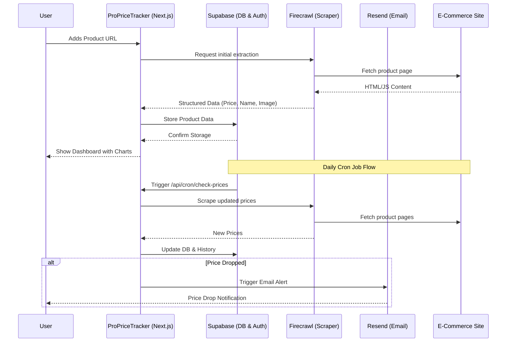

# ProPriceTracker - Advanced E-Commerce Price Monitor

ProPriceTracker is an intelligent and automated price tracking application that allows users to monitor product prices across various e-commerce platforms. Built with a modern Next.js stack, it uses Firecrawl for structured scraping, Supabase for scalable backend operations, and Resend for transactional email alerts.

## 🎯 Key Features

- 🛒 **Universal Tracking:** Monitor items from Amazon, BestBuy, Zara, Walmart, and virtually any e-commerce site.
- 📈 **Price Trends:** Visualize price history through detailed, interactive charts.
- 🔒 **Secure Auth:** Seamless Google OAuth integration via Supabase.
- 🤖 **Automated Checks:** Background cron jobs scrape and update prices daily.
- 📬 **Instant Alerts:** Receive customized emails the moment a price drops.

## 🏗️ Architecture Flow



## 🛠️ Technology Stack

- **Frontend:** Next.js (App Router), React, Tailwind CSS, shadcn/ui, Recharts
- **Backend:** Next.js API Routes, Supabase (PostgreSQL, pg_cron)
- **Extraction API:** Firecrawl (Handles JS rendering and proxies)
- **Notifications:** Resend (Email Delivery)

## 📁 Full Folder Structure

```text
ProPriceTracker/
├── .env.example                  # Template for environment variables
├── .gitignore                    # Git ignore rules
├── components.json               # shadcn/ui configuration
├── eslint.config.mjs             # ESLint configuration
├── next.config.mjs               # Next.js configuration
├── package.json                  # Dependencies and scripts
├── package-lock.json             # Locked dependency versions
├── postcss.config.mjs            # PostCSS configuration
├── proxy.ts                      # Next.js proxy (replaces middleware in some setups)
├── README.md                     # Project documentation
├── tsconfig.json                 # TypeScript configuration
├── app/                          # Next.js App Router root
│   ├── layout.tsx                # Root layout
│   ├── page.tsx                  # Landing and main application page
│   ├── actions.tsx               # Server actions for database operations
│   ├── error/
│   │   └── page.tsx              # Error fallback page
│   ├── auth/
│   │   └── callback/
│   │       └── route.tsx         # OAuth callback handler
│   └── api/
│       └── cron/
│           └── check-prices/
│               └── route.tsx     # Cron endpoint for price checking
├── components/                   # Reusable React components
│   ├── AddProductForm.tsx        # Form to submit new product URLs
│   ├── AuthButton.tsx            # Login/Logout button
│   ├── AuthModal.tsx             # Authentication modal dialog
│   ├── PriceChart.tsx            # Recharts-powered price history
│   ├── ProductCard.tsx           # Individual product display card
│   └── ui/                       # shadcn/ui generic components
│       ├── alert.tsx
│       ├── badge.tsx
│       ├── button.tsx
│       ├── card.tsx
│       ├── dialog.tsx
│       ├── input.tsx
│       └── sonner.tsx
├── lib/                          # Core business logic and integrations
│   ├── email.ts                  # Resend email templates and logic
│   ├── firecrawl.ts              # Firecrawl API scraper integration
│   └── utils.ts                  # Helper functions (e.g., class names)
├── public/                       # Static assets
│   └── deal-drop-logo.png        # Application logo
└── utils/                        # Utilities and Supabase clients
    └── supabase/
        ├── client.ts             # Browser client setup
        ├── middleware.ts         # Session refresh logic
        └── server.ts             # Server-side client setup
```

## 🚀 Setup Instructions

1. **Clone the Repository**
   ```bash
   git clone https://github.com/Ankit-cs/ProPriceTracker.git
   cd ProPriceTracker
   npm install
   ```

2. **Environment Configuration**
   Copy `.env.example` to `.env` and fill in the values:
   - Supabase project URL and keys.
   - Firecrawl API key.
   - Resend API key.
   - A generated `CRON_SECRET`.

3. **Supabase Database Setup**
   Ensure your Supabase project has the necessary tables (`products`, `price_history`) and that RLS policies are enabled. Also, configure `pg_cron` to ping the `/api/cron/check-prices` endpoint daily.

4. **Run Locally**
   ```bash
   npm run dev
   ```
   Open `http://localhost:3000` to start tracking!

## 📄 License
This project is licensed under the MIT License.
